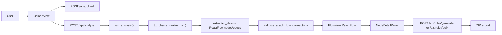

# Technical Workflow: `ttp_chainer` + Flow Visualization

This document explains how the standalone app processes input into an interactive attack flow, and where `ttp_chainer` and the visualization layer fit.

## 1) High-level flow

## 2) Backend pipeline details

### A. Input normalization and upload
- Endpoint: `webapp/backend/app/main.py` (`/api/upload`)
- File types:
  - STIX JSON bundle
  - PDF
  - text-like files (`txt/md/csv/log`)
- Upload returns normalized `text_content` (and optional parsed `stix_bundle`).

### B. Core analysis via `ttp_chainer`
- Endpoint: `webapp/backend/app/main.py` (`/api/analyze`)
- Main execution path:
  1. `run_analysis(text)` in `webapp/backend/app/analyze.py`
  2. `_ensure_ttp_chainer_on_path()` uses `TTP_CHAINER_PATH`
  3. Calls `aaftre.main(text)` from `ttp_chainer`
  4. Converts `extracted_data` to graph via `_extracted_data_to_react_flow(...)`
  5. Optional fallback from `ttp_flow` if needed
  6. Builds STIX bundle and AFB payload when available
- Connectivity guard:
  - `validate_attack_flow_connectivity(nodes, edges)` rejects disconnected graphs before sending to UI.

### C. Rule generation (single and bulk)
- Endpoints:
  - `/api/rules/generate` (node-level)
  - `/api/rules/bulk` (analysis-level ZIP)
- Implementation: `webapp/backend/app/rules.py`
- Uses server-side LLM (`litellm`) and selected output formats (Sigma, Splunk, EQL/KQL, YARA, Suricata, etc.).

## 3) “FlowViz” in this project

This repo does **not** embed the external `flowviz` project as a dependency.

Instead, it implements a **flowviz-style interactive graph** using:
- `ReactFlow` for graph canvas and interactions
- custom node components (`ActionNode`, `GenericNode`, `OperatorNode`)
- local layout utility (`applyLayout`) to position nodes

UI entry points:
- `webapp/frontend/src/views/FlowView.tsx`
- `webapp/frontend/src/components/nodes/*`

So in technical terms:
- `ttp_chainer` = extraction + chain intelligence
- React Flow layer = rendering/interaction (“flowviz-style” experience)

## 4) Export and sharing outputs

From the flow UI:
- PNG export (full-flow capture)
- Attack flow JSON (`nodes`, `edges`, stats)
- STIX bundle (if generated)
- MITRE AFB (if generated)
- Central detection rules ZIP with technology selection

Relevant frontend:
- `webapp/frontend/src/components/ExportBar.tsx`
- `webapp/frontend/src/components/RulesBulkDialog.tsx`

## 5) Runtime configuration notes

Key backend settings (in `webapp/backend/.env`):
- `OPENAI_API_KEY`
- `LLM_MODEL`
- `LLM_EXTRACTION_MODEL`
- `TTP_CHAINER_PATH`
- `FRONTEND_URL`

If `TTP_CHAINER_PATH` is wrong or API key is missing, analysis/rules will fail even if upload succeeds.
